## Technical bias in sequencing data

Michael Love

Research Fellow

Irizarry group, DFCI/HSPH

later: http://mikelove.github.io/techbias/

--- &vertical

## Bias

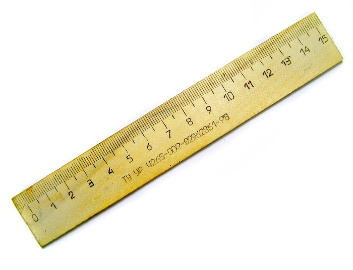

***

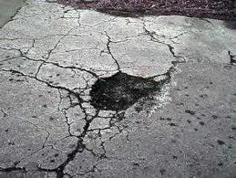

thought experiment: measure potholes in Boston vs Cambridge

1. everyone's rulers are off by +1 cm
2. Boston rulers left in the sun, stretched by +1 cm

***

1. bias cancels out
2. bias is correlated with comparison of interest

<br><br>

.fragment ...sounds simple, but still we see datasets with 100%
confounding of condition with experimental batch

---

## "Sequencing bias"

* this talk: bias in use of sequencing as a *quantitative* assay
* there is also bias in sequencing, e.g. calling bases A,C,G,T

--- &vertical

## Example 1: DNA sequencing

* we are sequencing DNA for genotyping
* meanwhile, use data to find copy number

***

## Copy number


relative to a reference genome

***

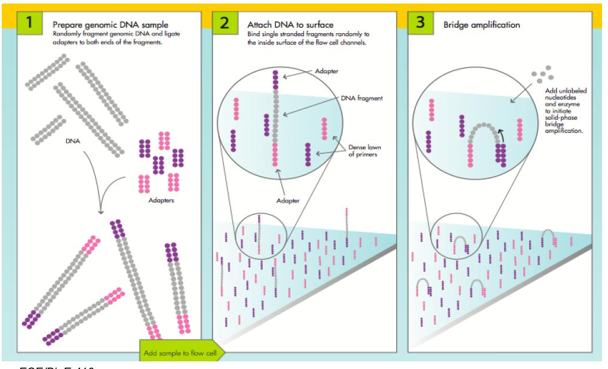

***

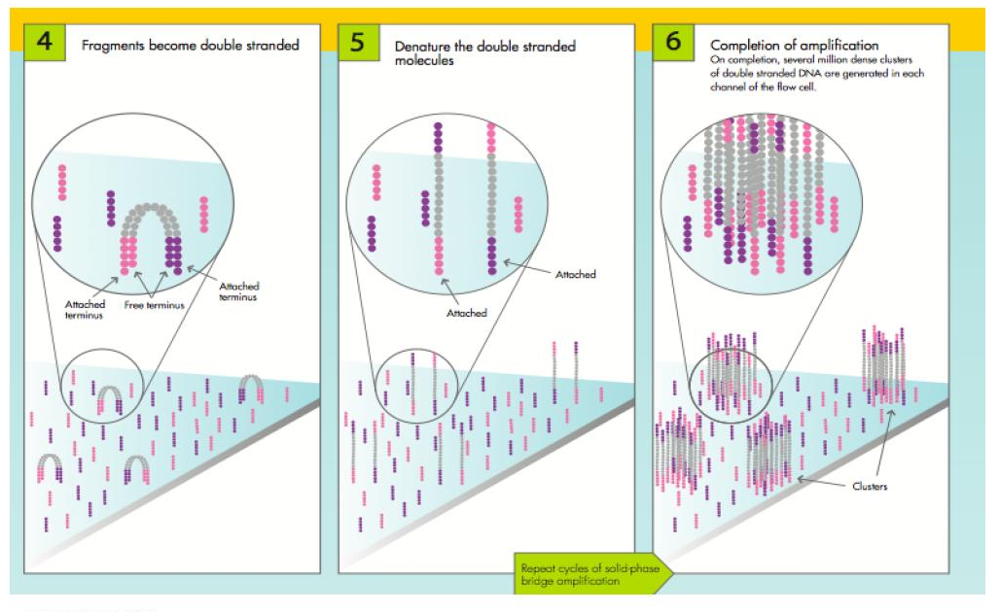

***


***

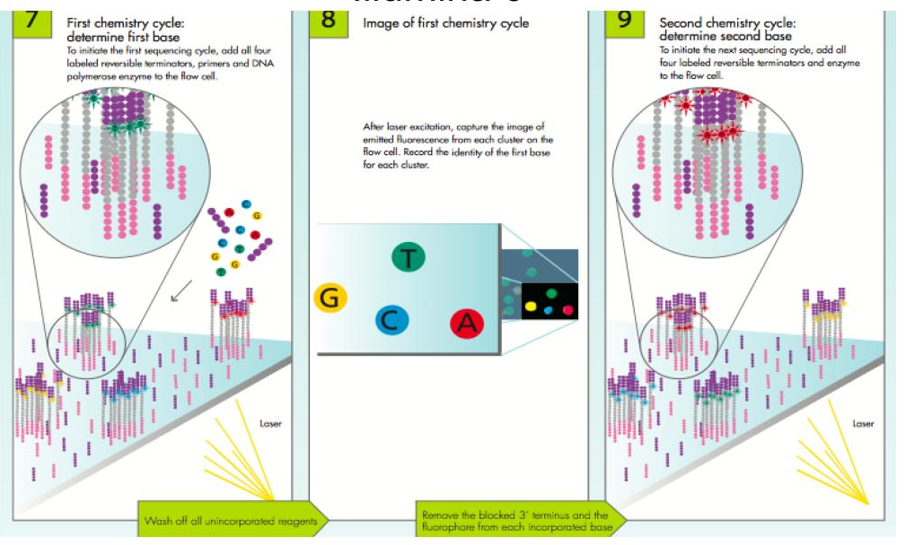

***

## Reads stored in "Fastq" file


***

## Align reads to reference genome

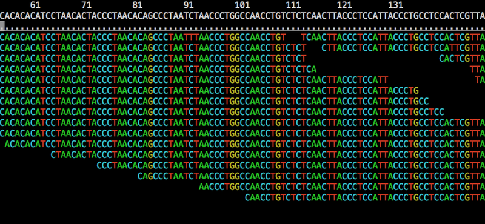

the local number of reads: "read depth"

***

## Local read depth

changes in read depth relative to a reference:

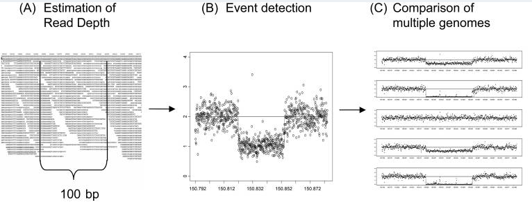

[Yoon et al 2009](http://www.ncbi.nlm.nih.gov/pmc/articles/PMC3378858)

***

## Copy number


***

## Bias

deviation of coverage from that expected <br>
from proporitions of molecules in the "pool"

***

```{r echo=FALSE}
plotCov <- function(t=30,m=10,plt=TRUE) {
  coverage1 <- c()
  coverage2 <- c()
  n <- 90
  copy1 <- 41:50
  copy2 <- 41:60
  seq1 <- seq_len(n)
  seq2 <- c(1:40, copy1, copy1, 51:90)
  if (plt) plot(0,0,xlab="",ylab="",xaxt="n",yaxt="n",ylim=c(0,n+10),xlim=c(0,1),type="n")
  for (i in 0:(t-1)) {
    x1 <- sample(seq1,m,TRUE)
    x2 <- sample(seq2,m,TRUE)
    xx2 <- sample(seq_len(n + 10),m,TRUE)
    col1 <- ifelse(seq1 %in% x1,"red",ifelse(seq1 %in% copy1,"dodgerblue","grey"))
    col2 <- ifelse(seq_len(n+10) %in% xx2,"red",ifelse(seq_len(n+10) %in% copy2,"dodgerblue","grey"))
    if (plt) points(rep(i/(t*2+10),n), seq_along(seq1), col=col1, pch=16)
    if (plt) points(rep((t+i+5)/(t*2+10),n+10), seq_along(seq2), col=col2, pch=16)
    coverage1 <- c(coverage1, x1)
    coverage2 <- c(coverage2, x2)
  }
  cbind(coverage1, coverage2)
}
coverage <- plotCov(t=1)
```

***

```{r echo=FALSE}
coverage <- plotCov(20)
```

***

```{r echo=FALSE}
coverage <- plotCov(1000, plt=FALSE)
par(mfrow=c(2,1),mar=c(5,5,1,1))
h1 <- hist(coverage[,1],col="grey50",border="white",xlab="position",main="",breaks=45)
h2 <- hist(coverage[,2],col="grey50",border="white",xlab="position",main="",breaks=45)
```
***


```{r echo=FALSE}
plot(h1$breaks[-1],h2$counts/h1$counts,xlab="position",ylab="ratio",type="b",ylim=c(0,3))
```

***

## Assumptions

* uniform rate of coverage
* or at least, sample / reference is ok

***

## Amplification

involves polymerase copying DNA many times over

<a href="http://www.rcsb.org/pdb/101/motm.do?momID=40">
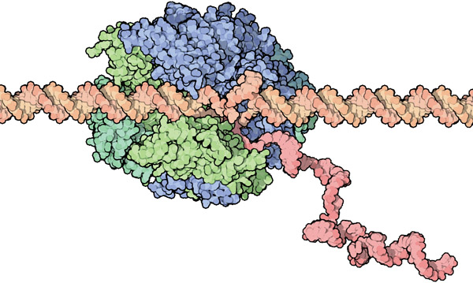
</a>

***

## Amplification

* polymerase has a preference for certain number of C,G
* slightly from different experiment to experiment

--- &vertical

## Observing GC bias

1. partition the genome into windows
2. count the number of reads
3. calculate the ratio (C+G)/(A+C+G+T)

***

## Differential GC bias
 
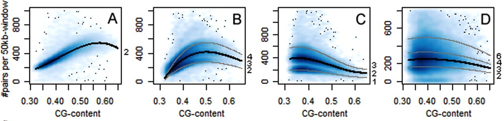

[Boeva et al 2010](http://bioinformatics.oxfordjournals.org/content/27/2/268.long)

***

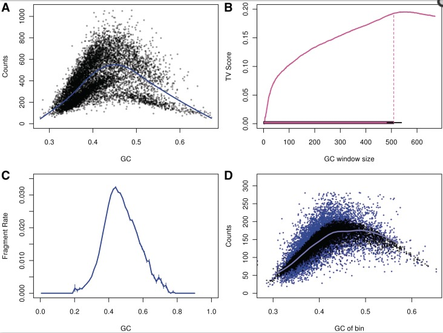

[Benjamini and Speed 2012](http://www.ncbi.nlm.nih.gov/pmc/articles/PMC3378858)

***

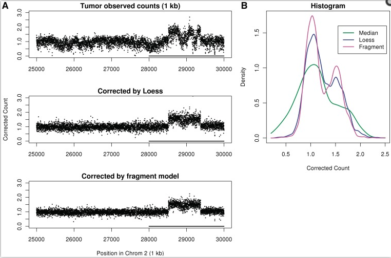

[Benjamini and Speed 2012](http://www.ncbi.nlm.nih.gov/pmc/articles/PMC3378858)

***

## Correction

<br>

* divide counts by prediction from model, $\hat{\mu}$
* .fragment then look at ratio of corrected counts
* .fragment alternatively, put $\hat{\mu}$ in the model

***

## Summary 1

* GC bias was *different* between sample and reference
* .fragment bias didn't cancel
* .fragment modeling on features we generated *in silico* helped


--- &vertical

## Example 2: RNA sequencing

* we want to quantify mRNA and compare across patients
* needed for research and as a marker in diagnostics

***

## RNA sequencing protocol

<a href="http://www.sciencedirect.com/science/article/pii/S0014482714000160">
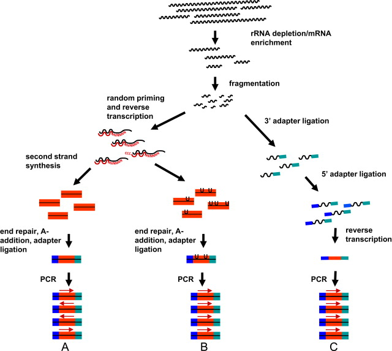
</a>

***

## Bias in RNA sequencing

deviation of coverage from expected <br>
given the proportion of molecules in the pool

***

## a few sources of bias

* fragmentation and size selection
* random hexamer primers (for RT)
* PCR

<br>

.fragment (other steps are certainly also important)

***

## fragmentation, size selection

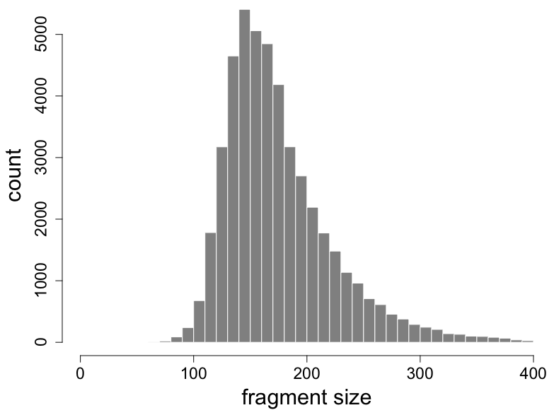

***

## fragmentation, size selection

```{r fig.width=9, fig.height=3, echo=FALSE}
x <- 40
y <- 10
par(mar=c(1,1,1,1))
plot(0,0,xlab="",ylab="",xaxt="n",yaxt="n",xlim=c(0,1),ylim=c(0,1),type="n",bty="n")
segments(1:5/x, 1:5/y, 6:10/x, 1:5/y, lwd=4)
segments(21:30/x, 1:10/y, 26:35/x, 1:10/y, lwd=4)
segments(1/x,0,10/x,0,lwd=6,col="dodgerblue")
segments(21/x,0,35/x,0,lwd=6,col="red")
```

***
## sequence specific bias

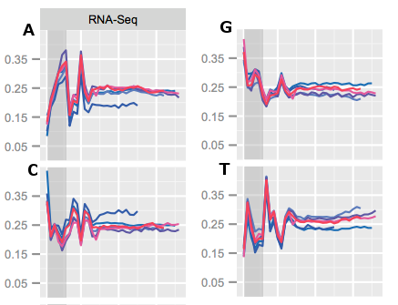

* random hexamer priming biases read starts
* weight each read using the observed freq's

[Hansen et al 2010](http://www.ncbi.nlm.nih.gov/pmc/articles/PMC2896536/)

***

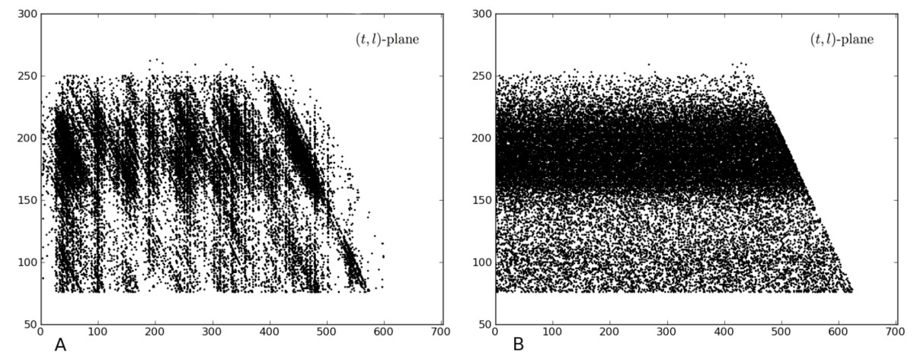

useful plot for identifying non-uniform coverage

[Evans, Hower and Pachter 2010](http://www.biomedcentral.com/1471-2105/11/430/)


***

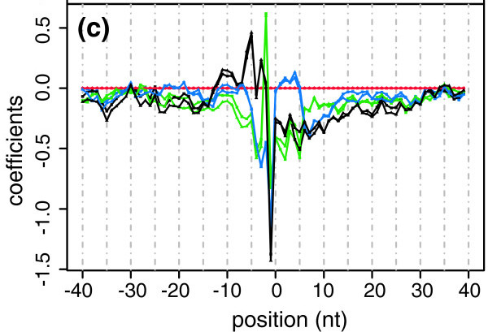

[Li, Jiang and Wong 2010](http://www.ncbi.nlm.nih.gov/pmc/articles/PMC2898062/)

linear model of the Poisson rate including sequence bias

***

## Multiple isoforms per gene

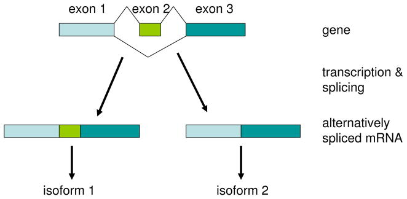

[Salzman, Jiang and Wong 2011](http://www.ncbi.nlm.nih.gov/pmc/articles/PMC3846358/)

model for estimating isoform abundances including fragmentation, size
selection, sequence bias

***

Probability of a vector of read counts $\vec{n}$, indexed by read type
*j*:

<br>

$$ f_\theta(\vec{n}) = \prod_j f_{Pois}(n_j, \vec{\theta} \cdot \vec{a}_j ) $$

* $\vec{\theta}$ are the isoform abundances
* $\vec{a}_j$ are the rates, 0 if read $j$ cannot be generated by the
  isoform
* rates include bias

<br>

[Salzman, Jiang and Wong 2011](http://www.ncbi.nlm.nih.gov/pmc/articles/PMC3846358/)

***

## Multiple isoforms per gene

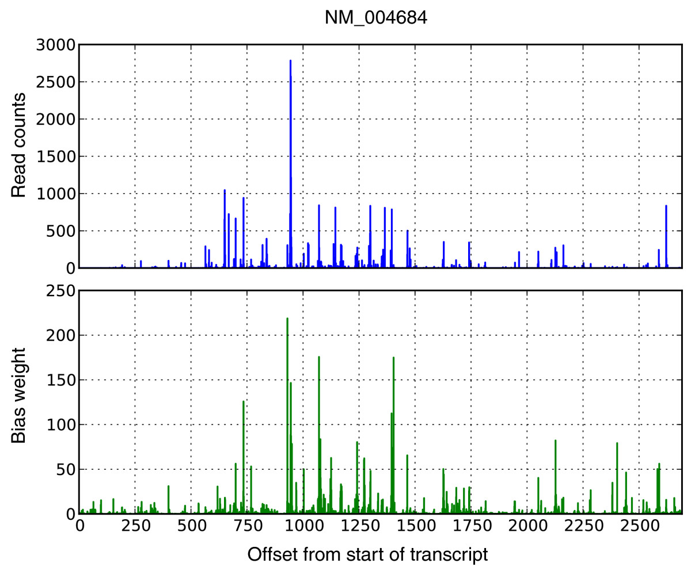

[Roberts et al 2011](http://genomebiology.com/2011/12/3/R22)

likelihood of isoform abundances given fragment length
distribution and sequence bias: used in *Cufflinks*

--- &vertical

## Aggregate bias at the gene level

* model gene counts on known covariates
* factor analysis
* add batch to model formula

***

### conditional quantile normalization

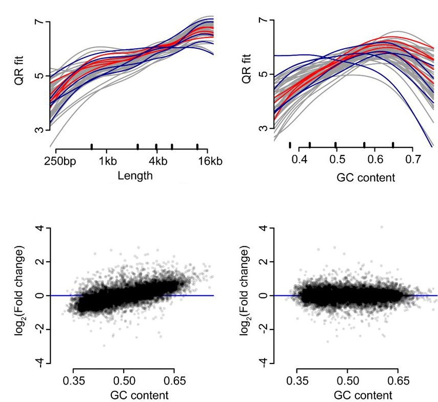

[Hansen, Irizarry and Wu 2011](http://biostatistics.oxfordjournals.org/content/13/2/204.full)

***

### Bias in batches


***

### Surrogate variable analysis


SVA: [Leek et al 2007](http://www.plosgenetics.org/article/info%3Adoi%2F10.1371%2Fjournal.pgen.0030161),
svaseq: [Leek 2014](http://nar.oxfordjournals.org/content/early/2014/10/07/nar.gku864.abstract)

***

## Add batch to the model

<br>

Per gene, model the mean for sample j, $\mu_j$, as:

<br>

$$ log(\mu_j) = \beta_0 + \beta_{b} 1_{j \in B} + \beta_{t} 1_{j \in T} $$

<br>

where *B* is the second batch, *T* is the treated samples.

***

## Summary 2

* At the read level:
  * .fragment Include bias in model for isoform abundances
* .fragment At the gene level:
  * .fragment Model on known covariates
  * .fragment Remove unknown batch differences with factor analysis
  * .fragment Remove any differences correlating with batch 

<br><br>

.fragment count $\sim$ $\mathcal{L}$ (bias $\cdot$ biology)

---

## Bias and batch

* Accurate measurements necessary for research
* Way more important if used as markers

<br>

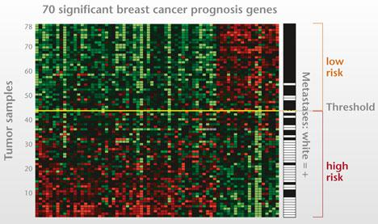


