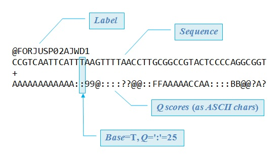
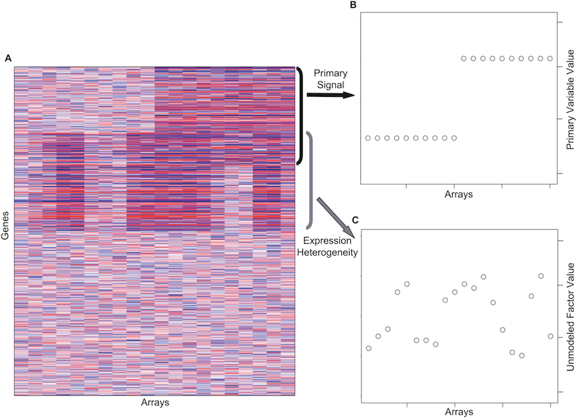

## Technical bias in sequencing data

Michael Love

Research Fellow

Irizarry group, DFCI/HSPH

--- &vertical

## Bias

***

thought experiment: measure potholes in Boston vs Cambridge

1. everyone's rulers are off by +1 cm
2. Boston rulers left in the sun, stretched by +1 cm

***

1. bias cancels out
2. bias is correlated with comparison of interest

  

.fragment ...sounds simple, but still we see datasets with 100%
confounding of condition with experimental batch

---

## "Sequencing bias"

* this talk: bias in use of sequencing as a *quantitative* assay
* there is also bias in sequencing, e.g. calling bases A,C,G,T

--- &vertical

## Example 1: DNA sequencing

* we are sequencing DNA for genotyping
* meanwhile, use data to find copy number

***

## Copy number

relative to a reference genome

***

### DNA sequencing

* colonies of identical molecules
* one "read" per colony/spot

***

***

***

***

## Reads stored in "Fastq" file

***

## Align reads to reference genome

the local number of reads: "read depth"

***

## Local read depth

changes in read depth relative to a reference:

[Yoon et al 2009](http://www.ncbi.nlm.nih.gov/pmc/articles/PMC3378858)

***

## Assumptions

* sample / reference is ok
* different rates of coverage?

***

## Amplification

involves polymerase copying DNA many times over

has a preference for balance of C,G over A,T ...

--- &vertical

## Observing GC bias

1. partition the genome into windows
2. count the number of reads
3. calculate the ratio (C+G)/(A+C+G+T)

***

## Differential GC bias
 

[Boeva 2010](http://bioinformatics.oxfordjournals.org/content/27/2/268.long)

***

[Benjamini and Speed 2012](http://www.ncbi.nlm.nih.gov/pmc/articles/PMC3378858)

***

[Benjamini and Speed 2012](http://www.ncbi.nlm.nih.gov/pmc/articles/PMC3378858)

***

## Correction

 

* divide counts by prediction from model: $\frac{x}{\hat{\mu}_x}$
* .fragment then look at ratio of corrected counts
* .fragment alternatively, put $\hat{\mu}_x$ in the model

***

## Summary 1

* GC bias was *different* between sample and reference
* .fragment bias didn't cancel
* .fragment modeling on features we generated *in silico* helped

--- &vertical

## Example 2: RNA sequencing

* we want to quantify mRNA and compare across patients
* needed for research and treatment: as a marker, diagnostics

***

## RNA sequencing protocol

***

## a few sources of bias

* fragmentation and size selection
* primer ligation
* PCR

 

.fragment (other steps are certainly also important)

***

[Hansen 2010](http://www.ncbi.nlm.nih.gov/pmc/articles/PMC2896536/)

[Evans, Hower and Pachter 2010](http://www.biomedcentral.com/1471-2105/11/430/)

[Roberts 2011](http://genomebiology.com/2011/12/3/R22)

[Zheng, Chung and Zhao 2011](http://www.biomedcentral.com/1471-2105/12/290)

--- &vertical

## Correcting bias at the gene level

* Conditional quantile normalization (cqn)
* Surrogate variable analysis (sva)
* add batch to model formula

***

### conditional quantile normalization

[Hansen 2011](http://biostatistics.oxfordjournals.org/content/13/2/204.full)

***

### Bias in batches

***

### Surrogate variable analysis

SVA: [Leek 2007](http://www.plosgenetics.org/article/info%3Adoi%2F10.1371%2Fjournal.pgen.0030161),
svaseq: [Leek 2014](http://nar.oxfordjournals.org/content/early/2014/10/07/nar.gku864.abstract)

***

## Bioconductor packages

* [cqn](http://www.bioconductor.org/packages/release/bioc/html/cqn.html)
* [EDASeq](http://www.bioconductor.org/packages/release/bioc/html/EDASeq.html)
* [sva](http://www.bioconductor.org/packages/release/bioc/html/sva.html)
* [RUVseq](http://www.bioconductor.org/packages/release/bioc/html/RUVseq.html)

***

## Add batch to the model

 

Per gene, model the mean for sample j, $\mu_j$, as:

 

$$ log(\mu_j) = \beta_0 + \beta_{b} 1_{j \in B} + \beta_{t} 1_{j \in T} $$

 

where *B* is the second batch, *T* is the treated samples.

