## Technical bias in sequencing data

Michael Love

Research Fellow

Irizarry group, DFCI/HSPH

later: http://mikelove.github.io/techbias/

--- &vertical

## Bias

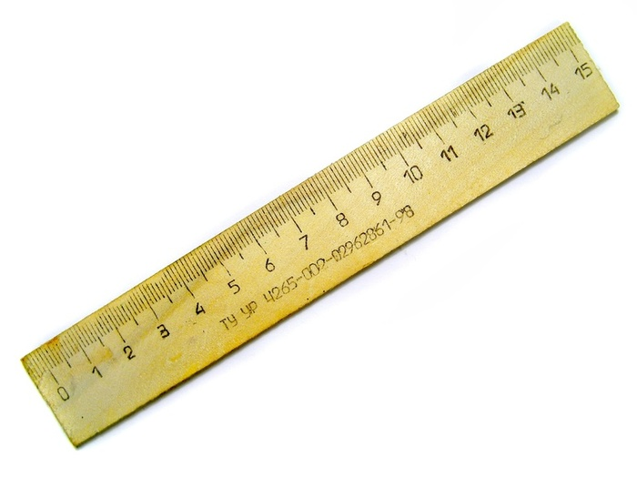

***

thought experiment: measure potholes in Boston vs Cambridge

1. everyone's rulers are off by +1 cm
2. Boston rulers left in the sun, stretched by +1 cm

***

1. bias cancels out
2. bias is correlated with comparison of interest

  

.fragment ...sounds simple, but still we see datasets with 100%
confounding of condition with experimental batch

---

## "Sequencing bias"

* this talk: bias in use of sequencing as a *quantitative* assay
* there is also bias in sequencing, e.g. calling bases A,C,G,T

--- &vertical

## Example 1: DNA sequencing

* we are sequencing DNA for genotyping
* meanwhile, use data to find copy number

***

## Copy number

relative to a reference genome

***

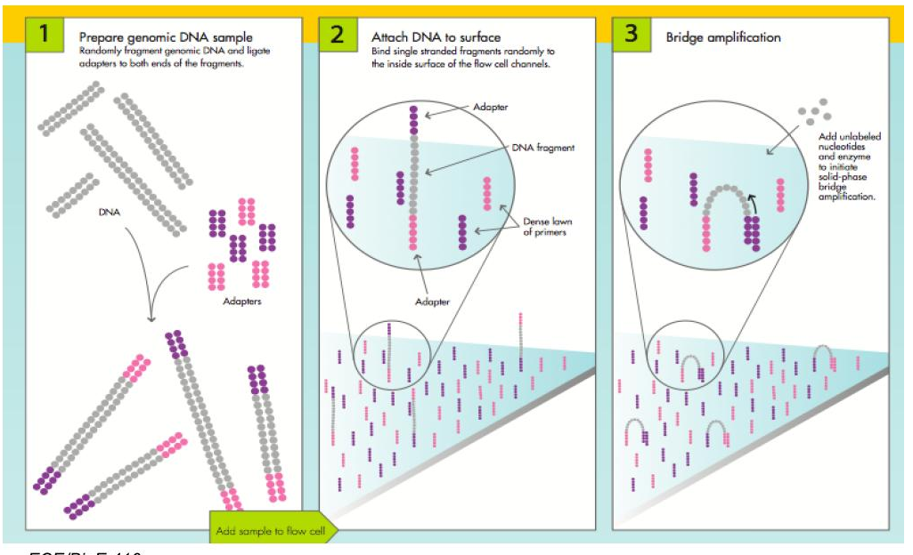

***

***

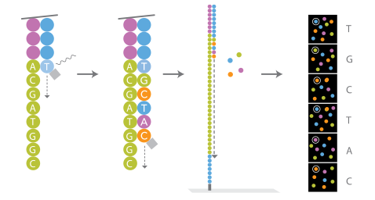

***

***

## Reads stored in "Fastq" file

***

## Align reads to reference genome

the local number of reads: "read depth"

***

## Local read depth

changes in read depth relative to a reference:

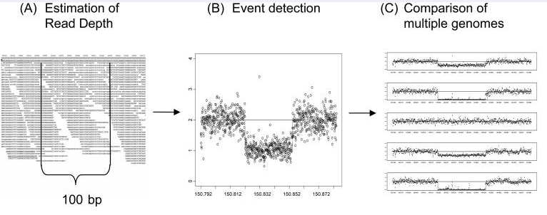

[Yoon et al 2009](http://www.ncbi.nlm.nih.gov/pmc/articles/PMC3378858)

***

## Copy number

***

## Bias

deviation of coverage from that expected  
from proporitions of molecules in the "pool"

***

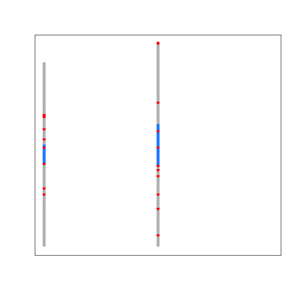 

***

 

***

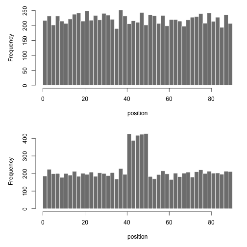 
***

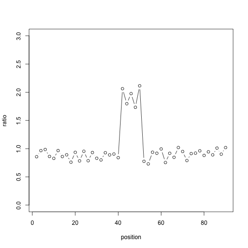 

***

## Assumptions

* sample / reference is ok
* uniform rate of coverage

***

## Amplification

involves polymerase copying DNA many times over

<a href="http://www.rcsb.org/pdb/101/motm.do?momID=40">
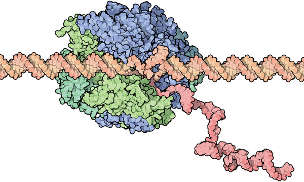
</a>

***

## Amplification

* polymerase has a preference for certain number of C,G
* slightly from different experiment to experiment

--- &vertical

## Observing GC bias

1. partition the genome into windows
2. count the number of reads
3. calculate the ratio (C+G)/(A+C+G+T)

***

## Differential GC bias
 
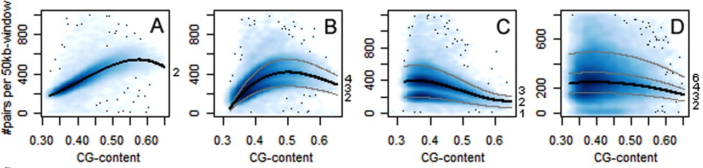

[Boeva et al 2010](http://bioinformatics.oxfordjournals.org/content/27/2/268.long)

***

[Benjamini and Speed 2012](http://www.ncbi.nlm.nih.gov/pmc/articles/PMC3378858)

***

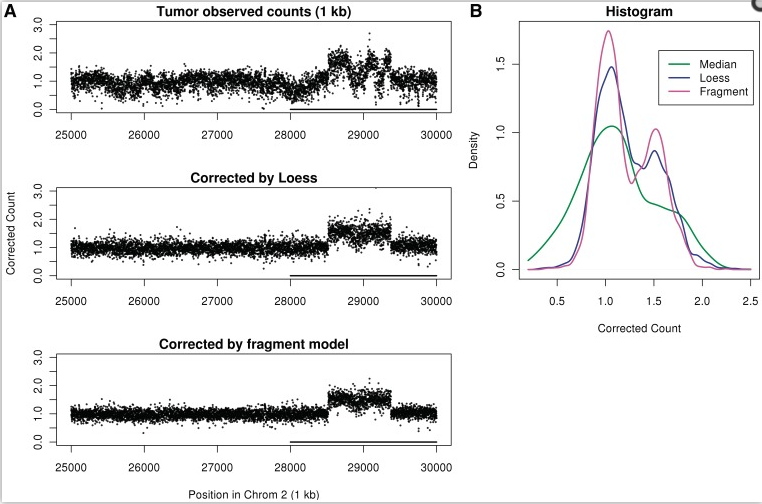

[Benjamini and Speed 2012](http://www.ncbi.nlm.nih.gov/pmc/articles/PMC3378858)

***

## Correction

 

* divide counts by prediction from model, $\hat{\mu}$
* .fragment then look at ratio of corrected counts
* .fragment alternatively, put $\hat{\mu}$ in the model

***

## Summary 1

* GC bias was *different* between sample and reference
* .fragment bias didn't cancel
* .fragment modeling on features we generated *in silico* helped

--- &vertical

## Example 2: RNA sequencing

* we want to quantify mRNA and compare across patients
* needed for research and as a marker in diagnostics

***

## RNA sequencing protocol

***

## Bias in RNA sequencing

deviation of coverage from expected  
given the proportion of molecules in the pool

***

## a few sources of bias

* fragmentation and size selection
* primer ligation
* PCR

 

.fragment (other steps are certainly also important)

***

## fragmentation, size selection

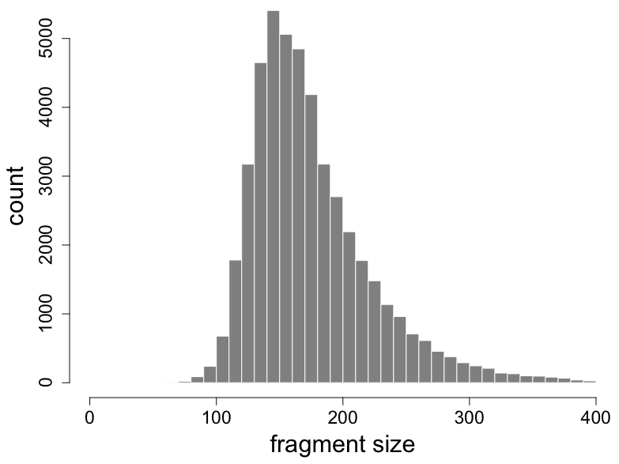

***

## fragmentation, size selection

 

***
## primer ligation

* random hexamer priming biases read starts
* weight each read using the observed freq's

[Hansen et al 2010](http://www.ncbi.nlm.nih.gov/pmc/articles/PMC2896536/)

***

useful plot for identifying non-uniform coverage

[Evans, Hower and Pachter 2010](http://www.biomedcentral.com/1471-2105/11/430/)

***

[Li, Jiang and Wong 2010](http://www.ncbi.nlm.nih.gov/pmc/articles/PMC2898062/)

linear model of the Poisson rate including sequence bias

***

## Multiple isoforms per gene

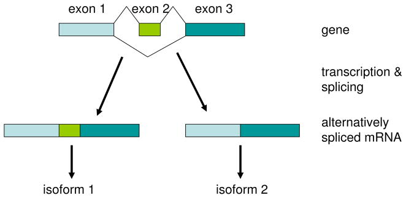

[Salzman, Jiang and Wong 2011](http://www.ncbi.nlm.nih.gov/pmc/articles/PMC3846358/)

model for estimating isoform abundances including fragmentation, size
selection, sequence bias

***

Probability of a vector of read counts $\vec{n}$, indexed by read type
*j*:

 

$$ f_\theta(\vec{n}) = \prod_j f_{Pois}(n_j, \vec{\theta} \cdot \vec{a}_j ) $$

* $\vec{\theta}$ are the isoform abundances
* $\vec{a}_j$ are the rates, 0 if read $j$ cannot be generated by the
  isoform
* rates include bias

 

[Salzman, Jiang and Wong 2011](http://www.ncbi.nlm.nih.gov/pmc/articles/PMC3846358/)

***

## Multiple isoforms per gene

[Roberts et al 2011](http://genomebiology.com/2011/12/3/R22)

likelihood of isoform abundances given fragment length
distribution and sequence bias: used in *Cufflinks*

--- &vertical

## Aggregate bias at the gene level

* model gene counts on known covariates
* factor analysis
* add batch to model formula

***

### conditional quantile normalization

[Hansen, Irizarry and Wu 2011](http://biostatistics.oxfordjournals.org/content/13/2/204.full)

***

### Bias in batches

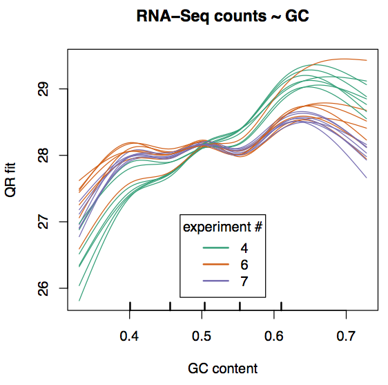

***

### Surrogate variable analysis

SVA: [Leek et al 2007](http://www.plosgenetics.org/article/info%3Adoi%2F10.1371%2Fjournal.pgen.0030161),
svaseq: [Leek 2014](http://nar.oxfordjournals.org/content/early/2014/10/07/nar.gku864.abstract)

***

## Add batch to the model

 

Per gene, model the mean for sample j, $\mu_j$, as:

 

$$ log(\mu_j) = \beta_0 + \beta_{b} 1_{j \in B} + \beta_{t} 1_{j \in T} $$

 

where *B* is the second batch, *T* is the treated samples.

***

## Summary 2

* At the read level:
  * .fragment Include bias in model for isoform abundances
* .fragment At the gene level:
  * .fragment Model on known covariates
  * .fragment Remove unknown batch differences with factor analysis
  * .fragment Remove any differences correlating with batch 

  

.fragment count $\sim$ $\mathcal{L}$ (bias $\cdot$ biology)

---

## Bias and batch

* Accurate measurements important for research
* Way more important: markers used in diagnostics

 

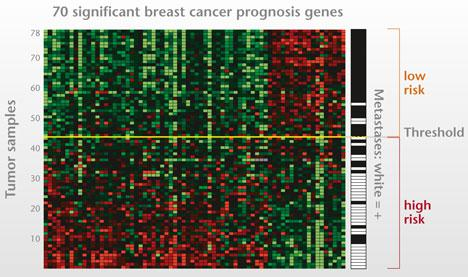

